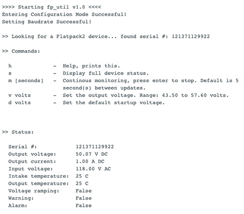
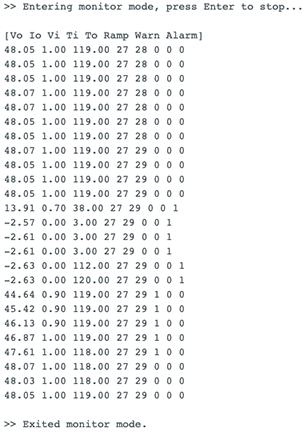
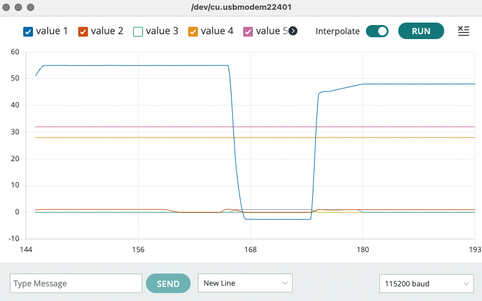

# fp_util
Yet another Arduino control utility for the Eltek Flatpack2 power supply.

This is a simple serial terminal app which allows you to manage an Eltek Flatpack2
power supply via an MCP2515 CAN controller chip. This should work with all Arduino-type shields,
as long as the CS & INT pin definitions are correct (you can modify these if needed).

You'll need to install the mcp_can and LibPrintf libraries -- the simplest method is 
via the Arduino IDE.

Note: you can use Arduino's serial plotter when in monitor mode. This works by accident!

Derived from https://github.com/the6p4c/Flatpack2/blob/master/Arduino/fp2_control/

## Information Sources
* https://github.com/neggles/flatpack2s2/blob/main/docs/Protocol.md
* https://github.com/the6p4c/Flatpack2/blob/master/Protocol.md
* https://openinverter.org/forum/viewtopic.php?t=1351
* https://github.com/neggles/flatpack2s2
* https://github.com/tomvanklinken/Flatpack2

## Screen Shots

### Startup and status command ('s')

### Monitor mode ('m')

### Serial plotter output

